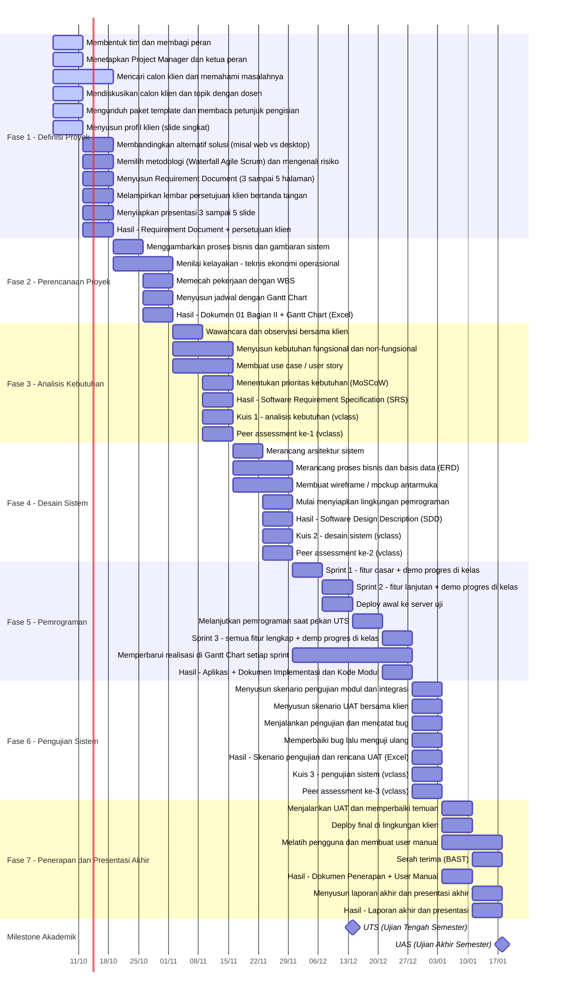

# Proyek PPSI: RAN Partner Bekasi

## Gantt Chart

<!-- GANTT:START -->
**Diperbarui:** 8 Oktober 2026 (otomatis oleh GitHub Actions)

- Task selesai: **0 dari 52**
- Progres rata-rata semua task: **0%**
- Progres tertimbang bobot nilai: **0%**
- Task terlambat: **0**



### Task terlambat

Tidak ada task yang melewati deadline.
<!-- GANTT:END -->

## Cara memakai

1. **Atur tanggal.** Ubah `start_date` di `config.json` menjadi tanggal Senin Minggu 1.
2. **Perbarui progres.** Edit kolom `progres` (0 sampai 100) di `tasks.csv` setiap sprint, lalu commit. Task dengan progres 100 dianggap selesai.
3. **Buat issue (sekali saja).** Buka tab Actions, pilih workflow "Gantt dan deteksi deadline", klik Run workflow, centang `create_issues`. Setiap task menjadi issue berjudul `[ID] nama task`.
4. **Selesai.** Setiap hari pukul 00:00 WIB workflow memperbarui Gantt di atas. Task yang lewat deadline dan progresnya belum 100 otomatis diberi label `terlambat` beserta komentar. Label dicabut sendiri saat progres menjadi 100 atau issue ditutup.

## Aturan deadline

Deadline sebuah task adalah hari Minggu di akhir `minggu_selesai`. Contoh dengan `start_date` 2026-10-05: task Minggu 1 sampai 2 berakhir pada 18 Oktober 2026.

## Uji coba lokal

```bash
python scripts/generate_gantt.py
GANTT_TODAY=2026-11-20 python scripts/sync_issues.py --dry-run   # simulasi tanggal tertentu
```

## Izin yang dibutuhkan

Di Settings, Actions, General, Workflow permissions, pilih **Read and write permissions** agar workflow bisa commit dan mengelola issue.
